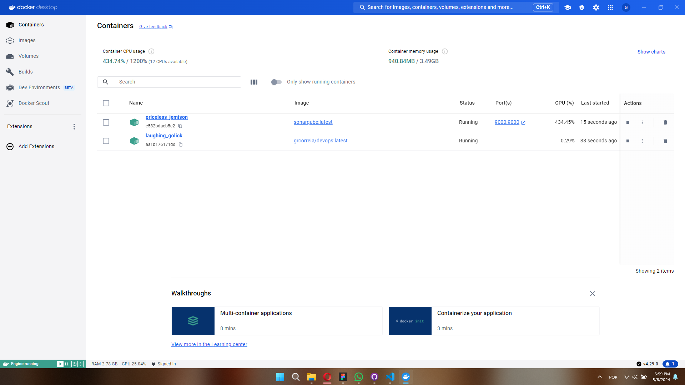
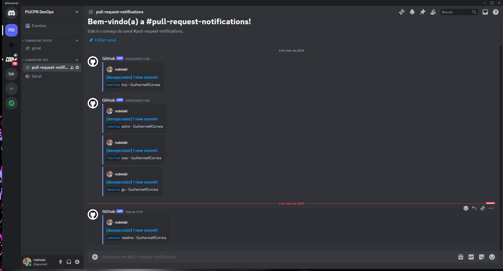
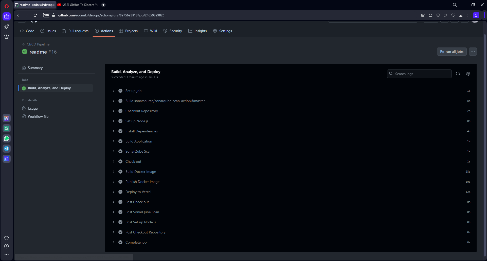
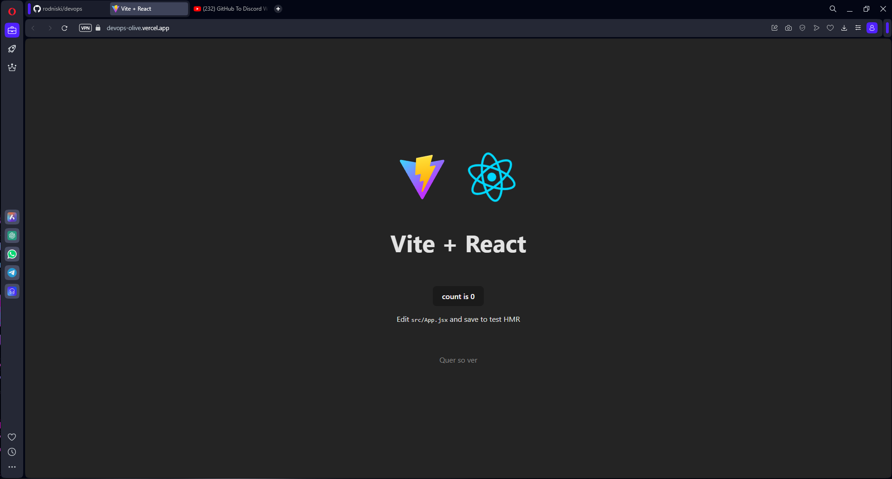

# React + Vite

Trabalho para a matéria de Devops, onde eu:
- Dockerizei a aplicação,
- Conectei com o Sonarqube (Também Dockerizado)

- Criei um webhook no discord

- E criei o Pipeline do Github Actions para realizar as operações necessárias.

Além disso, ainda contém dentro do projeto o ESLint que por onde eu sei é outra metodologia SAST.

O Modelo utilizado é o template do Vite na criação de projeto React e ele está atualmente públicado na Vercel

Espero que os professores gostem, foi uma matéria bem dificil, mas bem proveitosa.

Currently, two official plugins are available:

- [@vitejs/plugin-react](https://github.com/vitejs/vite-plugin-react/blob/main/packages/plugin-react/README.md) uses [Babel](https://babeljs.io/) for Fast Refresh
- [@vitejs/plugin-react-swc](https://github.com/vitejs/vite-plugin-react-swc) uses [SWC](https://swc.rs/) for Fast Refresh
